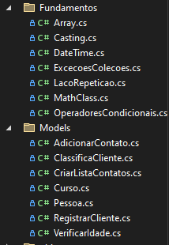

# Fundamentos c#

## Lógica aplicada a linguagem

## Contexto
Reunir os conhecimentos adquiridos de fundamentos. 

- **Casting**

- **Operadores Condicionais**

- **Classe Math** 

- **Laço de Repetição**

- **Array e List**

- **Propriedade, Metodos e Contrutores**

- **Valor monetário e Date Time**

- **Exceções e Coleções**

## 🌐 Socials:

 